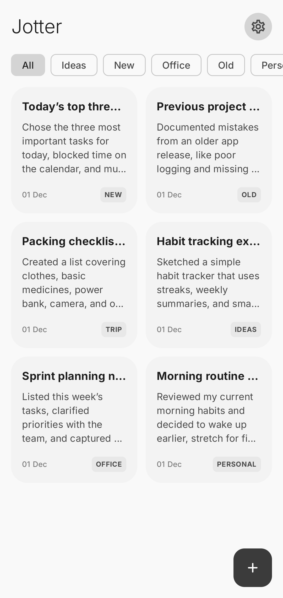
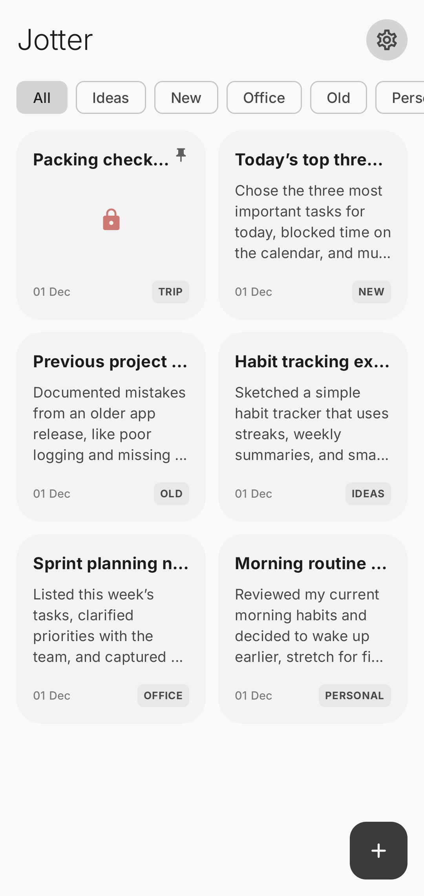
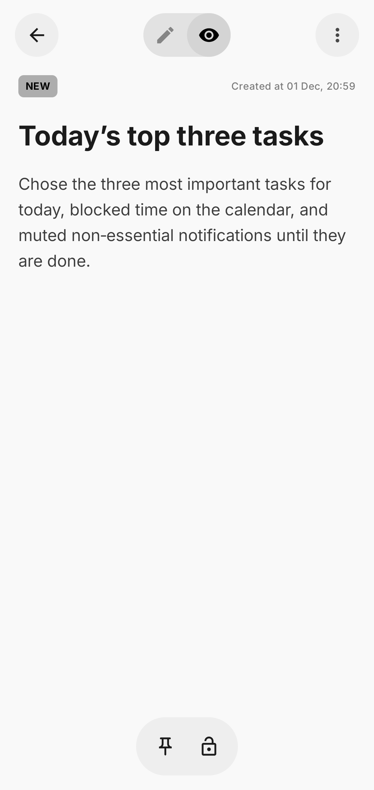
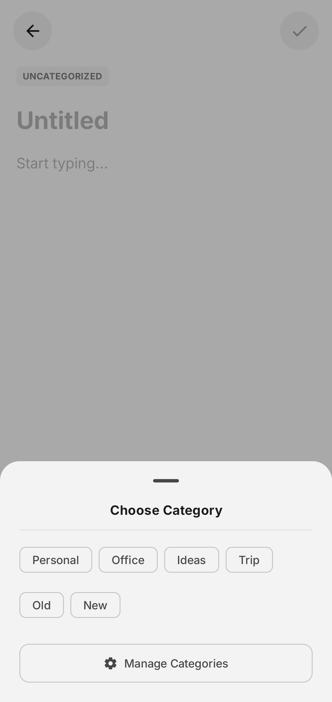
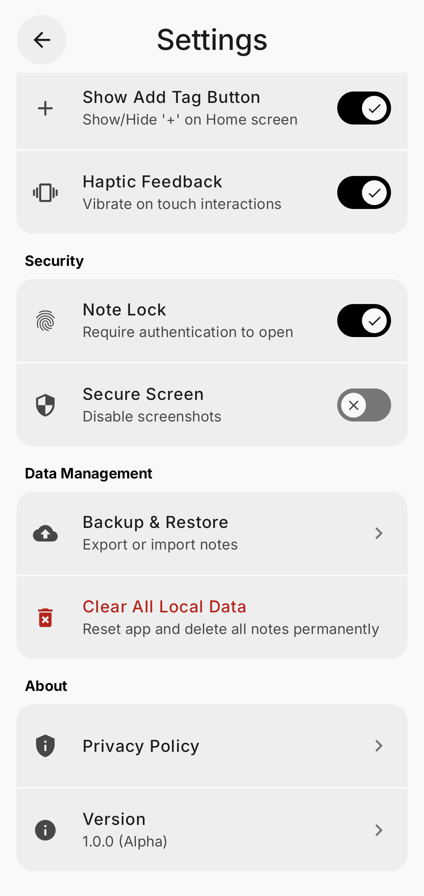
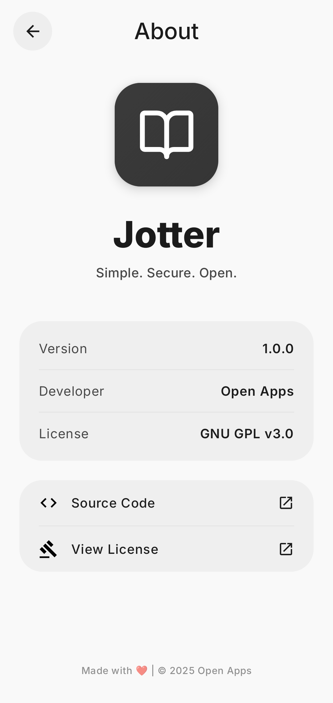

    

    
    
    
    
    
    

Jotter is a modern, free notes app with a sleek, beautiful design. Unlike others loaded with ads and extras, it focuses purely on speed, simplicity, and privacy—offline-first with a dynamic UI that feels effortless. No distractions. No tracking. Just your notes, fast, secure, and only yours.

---

## 📥 Download

Get the latest version of **Jotter**:

  
  
 
  
  

---

## 📱 Screenshots

  
  

  
  

  
  

  
  

## ✨ Features

* **Material You Design:** Fully compatible with Material 3 dynamic theming.
* **Rich Note Taking:** Create and edit notes seamlessly.
* **Offline First:** All data is stored locally using Room Database.
* **Dark Mode & True Dark Mode:** Fully optimized dark theme support.
* **Lock Notes:** Secure individual notes with a PIN or pattern.
* **Import & Export Notes:** Backup and restore your notes easily.
* **Sorting Options:** Organize notes with new sorting functionality.
* **Dynamic Colors:** App adapts to your system colors.
* **Trash & Archive:** Organize your notes without losing data.
* **Haptics Feedback:** Subtle feedback for interactions.
* **Multiple View Modes:** List, grid views for your notes.

---

## 🐛 Bug Reporting

If you encounter any bugs, issues, or unexpected behavior while using Jotter, please feel free to [open an issue](https://github.com/OpenAppsLabs/jotter/issues) on this repository.  

When reporting a bug, please include:

- Device/Android version
- Screenshots (if applicable)

This helps me fix problems faster and improve the app for everyone.
I welcome all constructive feedback and suggestions.

If you find Jotter useful, please consider ⭐ starring the repository to help others discover it.

## 📄 License

Jotter is licensed under the [GNU GPL v3.0](https://www.gnu.org/licenses/gpl-3.0.en.html).
